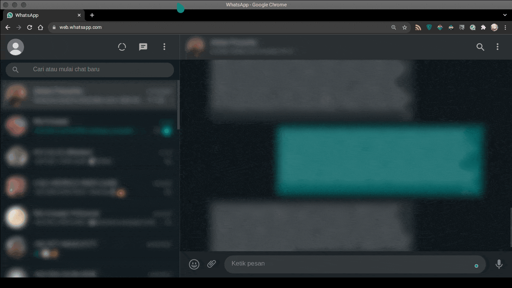

# Webchat Blur Browser Extension

Blur important content webchat apps like whatsapp & telegram until you hover on it.



## Developing

```sh
$ npm install

$ npm run watch # for chromium based browser
$ npm run watch:firefox # for firefox browser
```

## Building

```sh
$ npm install

$ npm run build # for chromium based browser
$ npm run build:firefox # for firefox browser
```
